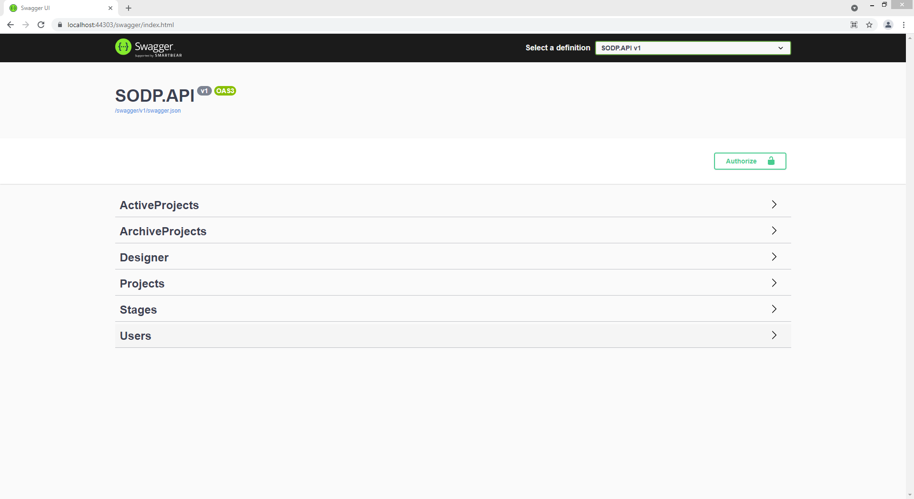

## SODP
- - -
System obsługi dokumentacji projektowej
Program do zarządzania prowadzonymi projektami (projekty/branże/projektanci )
Część serwerwerowa z dostępem przez REST API oraz aplikacja WEB UI

### UŻYTE TECHNOLOGIE
- - -
* .NET Core 3.1
* EF Core 3.1
* MySQL/MariaDB
* xUnit
* HTML5/CSS3
* JavaScript
* Bootstrap 4

### FUNKCJONALNOŚĆ
- - -
* REST API
* RAZORPAGE UI

### DOKUMENTACJA REST API
- - - 
https://localhost:44303/swagger/index.html

### STATUS
- - -
Projekt szkoleniowy w trakcie budowy. Testowany ochotniczo w jednym biurze.
