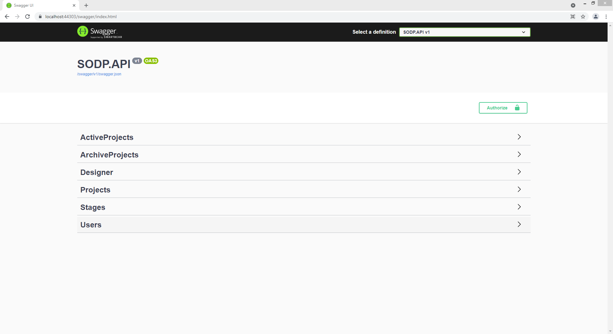

## SODP
- - -
Design documentation management system
Project management program (projects/industries/designers)
Server part with access via REST API and WEB UI application

### TECHNOLOGY STACK
- - -
* .NET Core 6
* EF Core 3.1
* MySQL/MariaDB
* xUnit
* Razor Pages
* HTML5/CSS3
* JavaScript
* Bootstrap 4

### FEATURES
- - -
- [ ] Project management
    - [ ] Create new project
    - [ ] Editing basic data
    - [ ] Archive (close) project
    - [ ] Resotore (reopen) project
    - [ ] Add part
        - [ ] Add branch to part
            - [ ] Add role to branch
                - [ ] Assign designer (license) to role
                - [ ] Remove designer (license) from role
            - [ ] Remove role from branch
        - [ ] Remove branch from part
    - [ ] Remove part
- [ ] Project stage management
    - [ ] Create stage
    - [ ] Edit stage
    - [ ] Remove unused stage
- [ ] Project part template management
    - [ ] Create part
    - [ ] Edit part
    - [ ] Remove part
- [ ] Project branch management
    - [ ] Create branch
    - [ ] Edit branch
    - [ ] Remove unused branch
- [ ] Designers management
    - [ ] Create designer
    - [ ] Edit designer
    - [ ] Remove unused designer
    - [ ] Add designer license in branch
    - [ ] Remove designer license from branch
- [ ] Investor template management
    - [ ] Create investor
    - [ ] Edit investor
    - [ ] Remove investor

### FUNCTIONALITY
- - -
* REST API
* RAZORPAGE UI

### REST API DOCUMENTATION
- - - 
* https://localhost:40303/swagger/index.html

### STATUS
- - -
Training project under construction. Tested voluntarily in one office.
